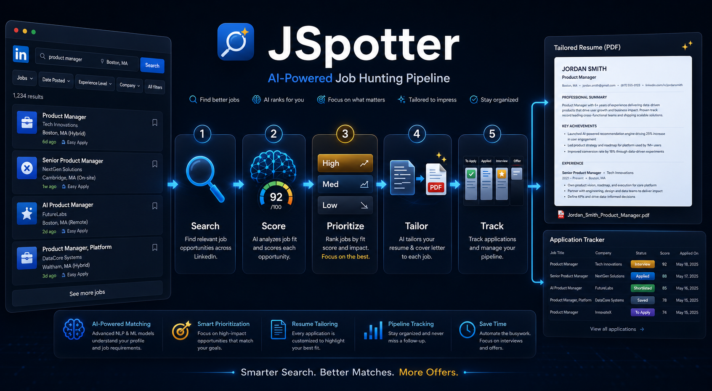

# JSpotter



AI-powered job hunting automation pipeline — LinkedIn search, LLM scoring, resume tailoring, and application tracking.

## Pipeline Stages

1. **Daily Job Search** — LinkedIn browser extraction (Boston + Remote)
2. **AI Scoring** — Match score, ATS score, interview probability (defined algorithms)
3. **Prioritization** — High/Medium/Low priority based on match score
4. **Resume Tailoring** — LLM-generated tailored resumes with PDF output
5. **Quality Gates** — Technical scoring (formula compliance, anti-conflation, ATS keywords) + human review (HR/HM perspectives)
6. **Application Tracking** — Journal-based tracking with status workflow and color coding

## Getting Started

1. Copy `templates/MASTER_PROFILE.template.md` and fill in your career details
2. Copy `templates/config.template.json` and configure your search parameters
3. Run the pipeline scripts in order

See [docs/SETUP.md](docs/SETUP.md) for detailed instructions.

## Project Structure

```
JSpotter/
├── scripts/                    # Pipeline scripts
│   ├── search_linkedin.py      # LinkedIn browser extraction
│   ├── journal.py              # Journal management (add, init, status)
│   ├── run_scoring.py          # Full scoring pipeline (match, ATS, interview prob)
│   ├── match_score.py          # Match score algorithm
│   ├── ats_score.py            # ATS keyword overlap score
│   ├── interview_prob.py       # Interview probability algorithm
│   ├── generate_pdf.py         # PDF + cover letter generator (ReportLab)
│   ├── quality_gate.py         # Technical quality gate (6 checks, 100pts)
│   ├── validate_tailoring.py   # Structural validation + auto-fix
│   ├── run_batch_review.py     # Batch LLM review (multiple resumes in one call)
│   ├── adapt_resume.py         # Same-company resume adapter
│   └── run_review.py           # Single resume LLM review
├── templates/                  # All templates (generic, no personal data)
│   ├── MASTER_PROFILE.template.md
│   ├── config.template.json
│   ├── theme.template.json
│   ├── tailoring_prompt_template.md
│   ├── review_prompt_template.md
│   └── cron_template.md
├── docs/                       # Setup and usage documentation
│   ├── SETUP.md                # Installation and configuration
│   └── CRON.md                 # Cron job setup and troubleshooting
├── CHANGELOG.md                # Release history
└── README.md
```

## Key Files (not in repo — create locally)

| File | Purpose |
|------|---------|
| `tailoring_prompt_local.md` | Working tailoring prompt with personal data |
| `config.json` | Search keywords, locations, scoring thresholds, career order |
| `theme.json` | Resume design (fonts, colors, margins, education, contact info) |
| `journal.xlsx` | Job tracking (5 sheets, color-coded statuses) |
| `resume/MASTER_PROFILE.md` | Your career profile |

## Requirements

- Python 3.10+
- openpyxl, reportlab
- Hermes Agent (for LLM scoring and resume tailoring)

## License

MIT